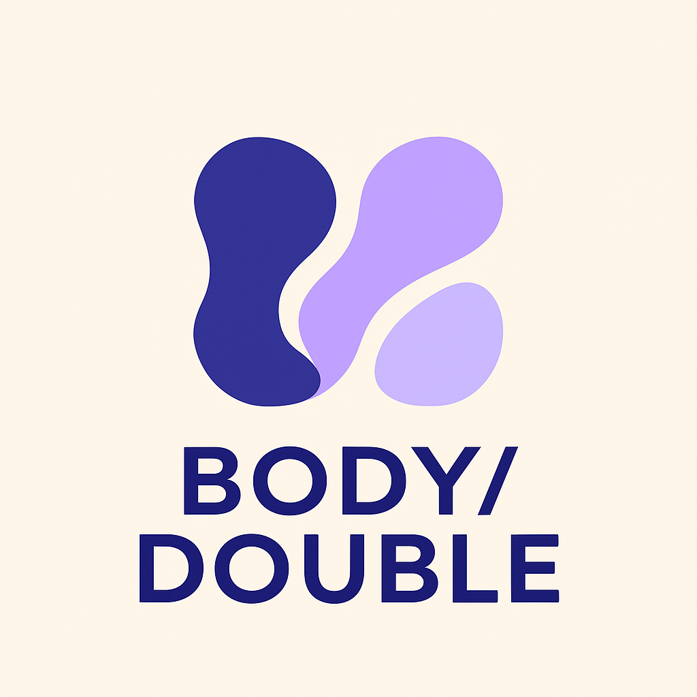

# BODY/DOUBLE

  

BODY/DOUBLE is a modern web application inspired by Omegle that helps users find accountability partners for work, study, or creative projects.
The platform allows users to connect with others who share similar goals, job titles, or classes and integrate focus sessions using the Pomodoro technique to stay productive together.

This project emphasizes responsive design, real-time collaboration concepts, and clean UI/UX principles.

---




## ✨ Features

* **Smart Matching Filters:** Connect with others based on shared interests, job titles, or study topics.
* **Pomodoro Integration:** Focus with timed work sessions and breaks to boost productivity.
* **Seamless Virtual Collaboration:** Meet, chat, and work alongside peers in real time.
* **Mondern UI Components:** Rounded cards, shadowed buttons, and minimalist typography inspired by productivity apps.
* **Scalable Structure:** Built with reusable EJS and CSS components for easy future expansion (e.g., chat, scheduling, and video integration).

## 🛠️ Tech Stack

* **Frontend:** EJS, CSS3 (Flexbox, Responsive Design), Vanilla JavaScript (ES6+)
* **Core Concepts:** DOM Manipulation, Event Handling, Modular Layout Structure, and User Interface Design Principles
* **Deployment:** Fly.IO

## 🚀 Getting Started

To get a local copy up and running, follow these steps.

1.  Clone the repository:
    ```sh
    git clone https://github.com/NaimaBogran/body-double.git
    ```
2.  Open `index.html` in your browser.


